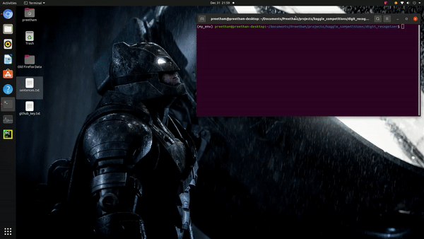

# Kaggle - Digit Recognizer

Author: [Preetham Ganesh](https://www.linkedin.com/in/preethamganesh/)

## Contents

- [Description](https://github.com/preetham-ganesh/forecast-of-rainfall-quantity#description)
- [Dataset](https://github.com/preetham-ganesh/forecast-of-rainfall-quantity#dataset)
- [Usage](https://github.com/preetham-ganesh/forecast-of-rainfall-quantity#usage)
	- [Requirement Installation](https://github.com/preetham-ganesh/forecast-of-rainfall-quantity#requirement-installment)
	- [Model Training and Testing](https://github.com/preetham-ganesh/forecast-of-rainfall-quantity#model-training-and-testing)
	- [How to run the application?](https://github.com/preetham-ganesh/forecast-of-rainfall-quantity#how-to-run-the-application?)
- [Future Work](https://github.com/preetham-ganesh/forecast-of-rainfall-quantity#future-work)
- [Support](https://github.com/preetham-ganesh/forecast-of-rainfall-quantity#support)
- [License](https://github.com/preetham-ganesh/forecast-of-rainfall-quantity#license)

## Description

- An application for recognizing hand written digits (0-9) using Convolutional Neural Networks.

## Dataset

- The data was downloaded from Kaggle - Digit Recognizer competition [[Link]](https://www.kaggle.com/c/digit-recognizer/data).
- Due to the size of the data, it is not available in the repository.
- After downloading the data, it should be saved in the data folder with the sub-folder named 'original_data'.
- The ZIP file downloaded using the above link, will have 2 CSV files, namely, Train and Test, which should be extracted and saved in the 'original_data' folder.

## Usage

### Requirement Installation

Use the package manager [pip](https://pip.pypa.io/en/stable/) to install requirements.

Requires: Python 3.6.

```bash
# Clone this repository
git clone https://github.com/preetham-ganesh/digit-recognizer.git
cd digit-recognizer

# Create a Conda environment with dependencies
conda env create -f environment.yml
conda activate dr_env
pip install -r requirements.txt
```

### Model Training and Testing

- Two types of models can be trained using the repository.
- The configuration dictionary in the model_training_testing.py code file has a key called 'model,' which can take values as either 1 or 2. 
- It can be changed by providing an argument while training the models.

```bash
python3 model_training_testing.py 1
```

or

```bash
python3 model_training_testing.py 2
```

### Running the application

A video demonstration on how to run the application is shown below:

<!--  -->


## Future Work

- Due to computational complexities, the application is executed on localhost.
- In the future, the application will be modified for hosting on an ML cloud server such as AWS or Google Cloud.

## Support

For any queries regarding the repository contact 'preetham.ganesh2015@gmail.com'.

## License

[GNU GPLv3](https://choosealicense.com/licenses/gpl-3.0/)
